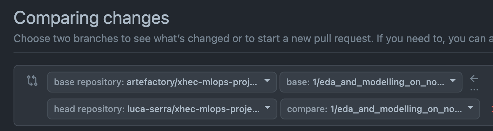

<div align="center">

# xhec-mlops-project-student

[]()
[](https://github.com/psf/black)

[](https://pycqa.github.io/isort/)
[](https://github.com/artefactory/xhec-mlops-project-student/blob/main/.pre-commit-config.yaml)
</div>

This repository has for purpose to industrialize the [Abalone age prediction](https://www.kaggle.com/datasets/rodolfomendes/abalone-dataset) Kaggle contest.

<details>
<summary>Details on the Abalone Dataset</summary>

The age of abalone is determined by cutting the shell through the cone, staining it, and counting the number of rings through a microscope -- a boring and time-consuming task. Other measurements, which are easier to obtain, are used to predict the age.

**Goal**: predict the age of abalone (column "Rings") from physical measurements ("Shell weight", "Diameter", etc...)

You can download the dataset on the [Kaggle page](https://www.kaggle.com/datasets/rodolfomendes/abalone-dataset) and put it in the data folder

</details>

## Table of Contents

- [xhec-mlops-project-student](#xhec-mlops-project-student)
  - [Table of Contents](#table-of-contents)
  - [Deliverables and Evaluation](#deliverables-and-evaluation)
    - [Deliverables](#deliverables)
    - [Evaluation](#evaluation)
  - [Steps to reproduce to build the deliverable](#steps-to-reproduce-to-build-the-deliverable)
    - [Pull requests in this project](#pull-requests-in-this-project)
    - [Tips to work on this project](#tips-to-work-on-this-project)

## Get Started

### 1. Clone the Repository
First, clone the forked repository to your local machine. Use the following command:

`git clone https://github.com/AlexandreFln/xhec-mlops-project-student`

and navigate into the correct directory
`cd xhec-mlops-project-student`


### 2. Set Up the Conda Environment

First, generate the `requirements.txt` from `requirements.in` by running the following command:

`pip-compile requirements.in`

This will create the requirements.txt file, which is needed for the environment setup.

This project uses an `environment.yml` file to manage dependencies. To create the environment, run the following command:

`conda env create --file environment.yml`

This will create a conda environment with the specified Python version (as defined in the environment.yml file) and install the required dependencies, including pip-tools.

Once the environment is created, activate it with the following command:

`conda activate mlops_project_9`

### 3. Download the Abalone Dataset
Download the dataset from Kaggle and place it in the appropriate directory as required by the project structure.

You can download the dataset from this link: [Abalone Dataset on Kaggle](https://archive.ics.uci.edu/ml/datasets/abalone).

Ensure that you place the dataset in the correct folder (e.g., a `data/` directory) as outlined in the project structure.


After completing these steps, you will be ready to run the project and start working on industrializing the abalone age prediction model.

### 4. Set Up Prefect for Workflow Orchestration

To set up Prefect for orchestrating the workflow, you will need to configure the Prefect server.

First, set the Prefect API URL with the following command:

`prefect config set PREFECT_API_URL=http://0.0.0.0:4200/api`

This will ensure that Prefect communicates with the correct API endpoint.

Next, start the Prefect server by running:

`prefect server start --host 0.0.0.0`

This command will launch the Prefect server locally, allowing you to track and manage workflows for the project.

Once the server is up and running, you are ready to start orchestrating your workflows and accessing it on http://0.0.0.0:4200/.

### 5. Run the Deployment Script

In a new terminal, navigate to the project directory and run the deployment script to deploy the model. Use the following command:

`python src.modelling.deployment.py`

This script will handle the deployment process for the model. Running it in parallel with the Prefect server ensures that the orchestration and deployment are synchronized.

## Deliverables and notation

### Deliverables

The deliverable of this project is a copy of this repository with the industrialization of the Abalone age prediction model. We expect to see:

1. a workflow to train a model using Prefect
- The workflows to train the model and to make the inference (prediction of the age of abalone) are in separate modules and use Prefect `flow` and `task` objects
- The code to get the trained model and encoder is in a separate module and must be reproducible (not necessarily in a docker container)
2. a Prefect deployment to retrain the model regularly
3. an API that runs on a local app and that allows users to make predictions on new data
  - A working API which can be used to make predictions on new data
    - The API can run on a docker container
    - The API has validation on input data (use Pydantic)

### Evaluation

Each of your pull requests will be graded based on the following criteria:

- **Clarity** and quality of code
  - good module structure
  - naming conventions
  - use of docstrings and type hinting
- **Formatting**
  - respect of clear code conventions

  *P.S. you can use a linter and automatic code formatters to help you with that*

- Proper **Functioning** of the code
  - the code must run without bugs

Bseides the evaluation of the pull requests, we will also evaluate:
- **Reproducibility** and clarity of instructions to run the code (we will actually try to run your code)
  - Having a clear README.md with
    - the context of the project
    - the name of the participants and their github users
    - the steps to recreate the Python environment
    - the instructions to run all parts of the code
- Use of *Pull Requests* (see below) to coordinate your collaboration

## Steps to reproduce to build the deliverable

To help you with the structure and order of steps to perform in this project, we created different pull requests templates.
Each branch in this repository corresponds to a future pull request and has an attached markdown file with the instructions to perform the tasks of the pull request.
Each branch starts with a number.
You can follow the order of the branches to build your project and collaborate.

> [!NOTE]
> There are "TODO" in the code of the different branches. Each "TODO" corresponds to a task to perform to build the project.
> [!IMPORTANT]
> Remember to remove all code that is not used before the end of the project (including all TODO tags in the code).

**Please follow these steps**:

- If not done already, create a GitHub account
- If not done already, create a [Kaggle account](https://www.kaggle.com/account/login?phase=startRegisterTab&returnUrl=%2F) (so you can download the dataset)
- Fork this repository (one person per group)

**WARNING**: make sure to **unselect** the option "Copy the `master` branch only", so you have all the branches in the forked repository.

- Add the different members of your group as admin to your forked repository
- Follow the order of the numbered branches and for each branch:
  - Read the PR_i.md (where i is the number of the branch) file to understand the task to perform
   > [!NOTE]
   > Dont forget to integrate your work from past branches (except for when working on branch #1 obviously (!))
   > ```bash
   > git checkout branch_number_i
   > git pull origin master
   > # At this point, you might have a VIM window opening, you can close it using the command ":wq"
   > git push
   > ```
    - Read and **follow** all the instructions in the the PR instructions file
    - Do as many commits as necessary on the branch_number_i to perform the task indicated in the corresponding markdown file
    - Open **A SINGLE** pull request from this branch to the main branch of your forked repository
    - Once done, merge the pull request in the main branch of your forked repository

### Pull requests in this project

Github [Pull Requests](https://docs.github.com/articles/about-pull-requests) are a way to propose changes to a repository. They have for purpose to integrate the work of *feature branches* into the main branch of the repository, with a collaborative review process.

**PR tips:**

Make sure that you select your own repository when selecting the base repository:



It should rather look like this:


### Tips to work on this project

- Use a virtual environment to install the dependencies of the project (conda or virtualenv for instance)

- Once your virtual environment is activated, install pre-commit hooks to automatically format your code before each commit:

```bash
pip install pre-commit
pre-commit install
```

This will guarantee that your code is formatted correctly and of good quality before each commit.

- Use a `requirements.in` file to list the dependencies of your project. You can use the following command to generate a `requirements.txt` file from a `requirements.in` file:

```bash
pip-compile requirements.in
```
